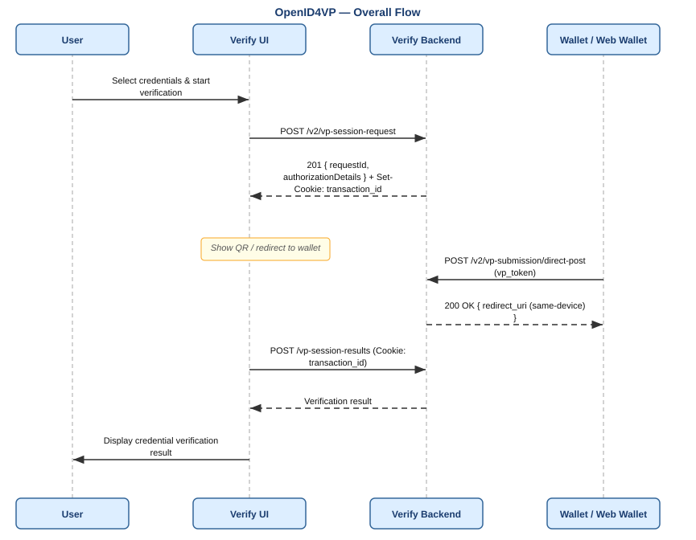
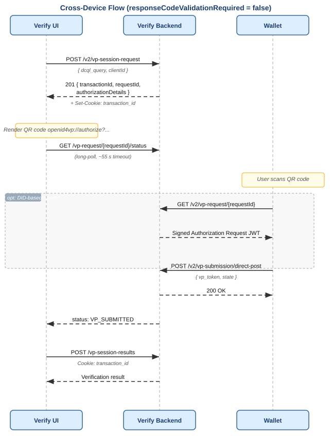
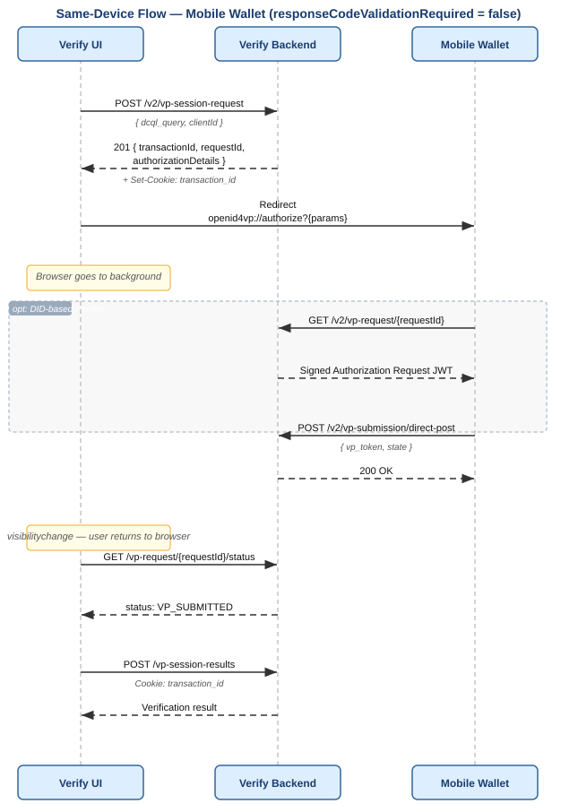
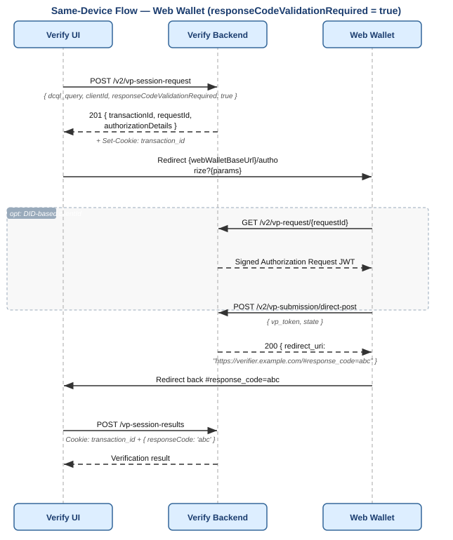

# OpenID4VP — Online Credential Sharing

Inji Verify supports the [OpenID for Verifiable Presentations v1.0](https://openid.net/specs/openid-4-verifiable-presentations-1_0.html) specification for requesting, presenting, and verifying credentials online.

| Specification | Version |
|---|---|
| OpenID for Verifiable Presentations | [v1.0](https://openid.net/specs/openid-4-verifiable-presentations-1_0.html) |
| SD-JWT VC | [draft-10 (`dc+sd-jwt`)](https://datatracker.ietf.org/doc/html/draft-ietf-oauth-sd-jwt-vc-10) |
| SD-JWT VC (legacy) | [draft-04 (`vc+sd-jwt`)](https://datatracker.ietf.org/doc/html/draft-ietf-oauth-sd-jwt-vc-04) |
| W3C Verifiable Credentials | JSON-LD (`ldp_vc`) |

Full API reference: [Inji Verify API documentation](https://mosip.stoplight.io/docs/inji-verify)

---

## Index

1. [Overall Flow](#overall-flow)
2. [What is DCQL?](#what-is-dcql)
3. [Flows](#flows)
4. [Authorization Request: Embedded vs. By Reference](#authorization-request-embedded-vs-by-reference)
5. [VP Submission](#vp-submission)
6. [Result Retrieval](#result-retrieval)
7. [Session Cookie](#session-cookie)
8. [API Reference](#api-reference)

---

## Overall Flow

Every OpenID4VP verification follows the same four steps regardless of which device or wallet type is used.



1. **Create VP request** — the verifier calls `POST /v2/vp-session-request` with a DCQL query describing which credentials to request. The backend returns a `requestId`, authorization parameters, and sets an HttpOnly session cookie.
2. **Deliver to wallet** — the authorization request is delivered to the wallet as a QR code (cross-device), a deep link (same-device mobile), or a browser redirect (same-device web wallet).
3. **Wallet submits VP** — the wallet POSTs the `vp_token` to `POST /v2/vp-submission/direct-post`.
4. **Fetch result** — the verifier UI calls `POST /vp-session-results` (with the session cookie) to retrieve the verification result.

---

## What is DCQL?

**DCQL (Digital Credentials Query Language)** is how a verifier describes which credentials it needs. It replaces the older Presentation Exchange (PEX) / `presentation_definition` format.

A verifier declares a `dcqlQuery` with a `credentials` array — each entry describes one credential to request. When the wallet responds, `vp_token` is a JSON object where each key matches a credential `id` and the value is an array of matching presentations. There is no `presentation_submission` object.

> **Unsupported:** `trusted_authorities` is not currently supported. DCQL queries containing `trusted_authorities` will be rejected with `UNKNOWN_FIELD`.

### Credential Query Fields

Each entry in `credentials` supports:

| Field | Description |
|---|---|
| `id` | Unique identifier for this credential query (alphanumeric, `_`, `-`) |
| `format` | VC format: `ldp_vc`, `dc+sd-jwt`, `vc+sd-jwt`, etc. |
| `meta` | Format-specific type constraints (see below) |
| `claims` | List of specific claim paths to request from the credential |
| `claim_sets` | Alternative sets of claims — wallet must satisfy at least one set |
| `multiple` | Whether the wallet may submit more than one credential for this query. Defaults to `false` — wallet must submit exactly one. |
| `require_cryptographic_holder_binding` | Whether the wallet must prove possession of the credential's key. Defaults to `true`. See below. |

### `require_cryptographic_holder_binding`

This field controls whether the wallet is required to prove it holds the private key bound to the credential. It defaults to `true` and its effect differs by format:

| Format | `true` (default) | `false` |
|---|---|---|
| `ldp_vc` | Wallet must submit a **VerifiablePresentation** wrapping the VC, with a valid Linked Data Proof signed by the holder's key. | Wallet submits a bare **VerifiableCredential** — no VP wrapper or proof required. |
| `dc+sd-jwt` / `vc+sd-jwt` | SD-JWT must include a `cnf` claim and a **KB-JWT**. The KB-JWT `aud` must match `clientId` and `nonce` must match the auth request nonce. | No KB-JWT required. The SD-JWT is accepted without key binding. |

Set `require_cryptographic_holder_binding: false` only when issuing or verifying credentials that do not support key binding (e.g. bearer credentials with no `cnf` claim).

### Type Constraints in `meta`

| Field | Applies to | Description |
|---|---|---|
| `type_values` | `ldp_vc` | Array of required `type` arrays. Each inner array is an AND condition; outer array is OR. |
| `vct_values` | `dc+sd-jwt`, `vc+sd-jwt` | Array of acceptable `vct` (Verifiable Credential Type) strings. |

### `credential_sets`

The top-level `credential_sets` field lets the verifier express alternative combinations of credentials. Each set lists credential `ids` that must all be satisfied together. The wallet fulfils the request by satisfying at least one set.

```json
{
  "credentials": [
    { "id": "id_card", "format": "ldp_vc", "meta": { "type_values": [["VerifiableCredential", "IDCard"]] } },
    { "id": "passport", "format": "dc+sd-jwt", "meta": { "vct_values": ["PassportCredential"] } }
  ],
  "credential_sets": [
    { "options": [["id_card"], ["passport"]] }
  ]
}
```

Here the wallet can satisfy the request with either the `id_card` or the `passport` — not necessarily both.

### Claims and Claim Sets

`claims` requests specific fields from a credential by JSON path:

```json
"claims": [
  { "path": ["birthDate"] },
  { "path": ["givenName"] }
]
```

> **Claim path root for `ldp_vc`:** Paths are resolved against `credentialSubject`, not the VC root. `["birthDate"]` matches `credentialSubject.birthDate`. Do not prefix paths with `"credentialSubject"`.

`claim_sets` groups claims into alternatives — the wallet must satisfy at least one group:

```json
"claim_sets": [
  ["birthDate"],
  ["age_over_18"]
]
```

### Full Example

```json
{
  "credentials": [
    {
      "id": "age_credential",
      "format": "ldp_vc",
      "meta": {
        "type_values": [["VerifiableCredential", "AgeCredential"]]
      },
      "claims": [
        { "path": ["birthDate"] }
      ]
    }
  ]
}
```

**Corresponding `vp_token` the wallet sends back:**
```json
{
  "age_credential": [
    {
      "@context": ["https://www.w3.org/2018/credentials/v1"],
      "type": ["VerifiablePresentation"],
      "verifiableCredential": [{ "...": "..." }],
      "proof": { "...": "..." }
    }
  ]
}
```

---

## Flows

Inji Verify supports three flows. The `OpenID4VPVerification` SDK component selects the right one automatically based on props — integrators do not need to implement flow logic manually. See [OpenID4VP_Inji_Verify_SDK.md](./OpenID4VP_Inji_Verify_SDK.md) for the full SDK prop reference.

### 1. Cross-Device Flow

Used when the verifier UI (desktop browser) and the wallet are on **different devices**. The verifier shows a QR code; the user scans it with their mobile wallet.

Set `isSameDeviceFlowEnabled={false}` on the SDK component to always use this flow.



---

### 2. Same-Device Flow — Mobile Wallet

Used when the verifier UI and wallet are on the **same mobile device**. The SDK detects a mobile browser and redirects to the wallet via a deep link — no QR code is shown.



**Key behaviour:**
- The SDK sets `responseCodeValidationRequired=true`. After VP submission the backend returns `redirect_uri` with `#response_code=` (existing same-device path) so the mobile wallet can send the user back. Cross-device QR omits the flag and receives `200 OK`.
- The SDK registers a `visibilitychange` listener before redirecting. When the user returns to the original browser tab, polling resumes using the saved `requestId` and the session cookie (without requiring `response_code`).

---

### 3. Same-Device Flow — Web Wallet

Used when a **browser-based wallet** is available. The SDK redirects to the web wallet's authorize URL. Because a full-page redirect loses the page session, a short-lived `response_code` is used to securely resume on return.

Set `webWalletBaseUrl` on the SDK component to enable this flow.



**Key behaviour:**
- The backend generates a short-lived (5 min), single-use `response_code` returned in `redirect_uri` as a hash fragment.
- On redirect back, the SDK reads `response_code` from `window.location.hash` and passes it to `/vp-session-results`.
- The HttpOnly cookie is sent automatically by the browser to authenticate the session.

---

## Authorization Request: Embedded vs. By Reference

When the verifier creates a VP request, the SDK encodes the authorization parameters into a QR code or redirect URL. The form this takes depends on the `clientId` scheme.

**Embedded (pre-registered client ID)**

All authorization parameters are packed directly into the QR URI. The wallet reads everything it needs from the QR — no extra network call required before submitting.

```
openid4vp://authorize
  ?client_id=client123
  &state={requestId}
  &response_type=vp_token
  &response_mode=direct_post
  &nonce={nonce}
  &response_uri={backendUrl}/v2/vp-submission/direct-post
  &dcql_query={url-encoded JSON}
```

**By Reference (DID-based client ID)**

When `clientId` starts with `decentralized_identifier:`, the authorization request is signed as a JWT and published at a URL. The QR contains only a pointer (`request_uri`). The wallet fetches and cryptographically verifies the JWT using the verifier's DID document before proceeding.

```
openid4vp://authorize
  ?client_id=decentralized_identifier:did:web:verify.example.com
  &request_uri={backendUrl}/v2/vp-request/{requestId}
```

**By Reference (certificate-based client ID)**

When `clientId` starts with `x509_san_dns:`, the request JWT is signed the same way but the header carries the signing certificate chain (`x5c`) instead of a `kid`. The wallet verifies the JWT using the embedded certificate directly, and checks that the DNS name in `clientId` is one of the certificate's Subject Alternative Names — no DID resolution involved.

```text
openid4vp://authorize
  ?client_id=x509_san_dns:verify.example.com
  &request_uri={backendUrl}/v2/vp-request/{requestId}
```

`x509_san_dns` requests go through additional checks on top of the DID flow's:
- At request-creation time, the DNS name in `clientId` must match this deployment's configured `inji.verify.x509-san-dns.host`, and (outside local/dev) the response endpoint must be served over `https`.
- At JWT-signing time, the signing certificate must currently be valid (not expired, not before its `notBefore` date) and its Subject Alternative Name must actually contain the claimed DNS name.

See [Inji_Verify_API_Overview.md](./Inji_Verify_API_Overview.md#openid4vp--vp-request-creation) for the exact error responses these produce, and [`verify-core/README.md`](../../verify-core/README.md) for keystore/config requirements.
**Not checked:** Whether `response_uri`'s host matches the `x509_san_dns` `client_id`.

`response_uri` is configured separately through `inji.vp-submission.base-url`, so its host may differ from `inji.verify.x509-san-dns.host`.

If the wallet does not already trust the certificate, the two hosts should match for the request to be accepted.

See [`verify-core/README.md`](../../verify-core/README.md) for details.

A deployment can serve both by-reference schemes side by side — which header a request JWT gets (`kid` or `x5c`) is decided per-request from its own `client_id` prefix, not a global setting.

| | Embedded | By Reference (DID) | By Reference (certificate) |
|---|---|---|---|
| QR carries | Full auth params | `request_uri` pointer only | `request_uri` pointer only |
| Wallet extra network call | None | `GET /v2/vp-request/{requestId}` | `GET /v2/vp-request/{requestId}` |
| Verifier identity proof | None | Ed25519 JWT, `kid` resolved via DID document | Ed25519 JWT, `x5c` cert chain in the header |
| `clientId` format | Plain string | `decentralized_identifier:did:...` | `x509_san_dns:<dns-name>` |

---

## VP Submission

The wallet submits the Verifiable Presentation to `POST /v2/vp-submission/direct-post` as `application/x-www-form-urlencoded`:

- `vp_token` — JSON object keyed by DCQL `query_id`, each value an array of presentations
- `state` — the `requestId` from the VP request

On wallet error instead: `error`, `error_description`, `state`.

The backend validates in this order:

**1. Request parameters**
- Only `vp_token`, `state`, `error`, `error_description` are allowed — any unknown parameter is rejected
- Either `vp_token` or `error` must be present (both absent → rejected)
- `vp_token` and `error` are mutually exclusive
- `error_description` cannot be combined with `vp_token`
- `error_description` requires `error` to also be present

**2. State**
- `state` must not be empty
- Must match a known VP request
- VP request must not be expired
- VP request must not have already received a submission

**3. `vp_token` structure**
- Must be a valid JSON object (not the string `"null"`)
- Must contain at least one key-value pair
- All values must be arrays with at least one element
- All elements within each array must be the same type — either all JSON objects (`ldp_vc`) or all strings (SD-JWT)
- No duplicate DCQL query IDs allowed as keys

**4. DCQL validation**

The submitted `vp_token` is validated against the DCQL query declared in the VP request:

- No unknown credential IDs — every key in `vp_token` must correspond to a declared credential `id`
- All declared credential IDs must be present, unless `credential_sets` is used — in that case every required credential set must have at least one option fully satisfied
- Each submitted credential must match its declared `format` — `ldp_vc` must be a JSON object VP or VC; SD-JWT must be a textual SD-JWT string
- If `multiple=false` (default), each credential array must contain exactly one element
- `type_values` (`ldp_vc`): at least one inner type array must be fully present in the credential's `type` field (OR-of-ANDs). When holder binding is required, this check applies to each inner VC inside the VP
- `vct_values` (SD-JWT): the `vct` claim must be present and exactly match one of the declared values
- Claim paths: all declared `claims` paths must resolve to a value. For `ldp_vc`, paths are resolved within `credentialSubject`; for SD-JWT, paths are resolved against all claims in the token (both payload claims and selectively disclosed claims). If `values` are declared on a claim, the resolved value must type-and-value match at least one
- Claim sets: if `claim_sets` is present, at least one option (inner array of claim IDs) must be fully satisfied (OR-of-ANDs)

**5. Holder binding**

For `ldp_vc` (Verifiable Presentation):
- VP Linked Data Proof signature is verified against the issuer's public key
- `proof.domain` must match the auth request `clientId`
- `proof.challenge` must match the auth request `nonce`
- `holder` field must be present in the VP
- VP `proof.verificationMethod` must resolve to the same public key as `holder` (proof of possession)
- For each inner VC: `credentialSubject.id` must resolve to the same public key as `holder` — i.e. the holder is the subject of each credential. This check applies only when `credentialSubject.id` is a `did:key` or `did:jwk`; other DID methods skip this check

For SD-JWT (when `require_cryptographic_holder_binding=true`):
- SD-JWT must have a `cnf` claim (containing `jwk` or a DID-based `kid`)
- SD-JWT must include a KB-JWT (Key Binding JWT)
- KB-JWT `typ` header must be `kb+jwt`
- KB-JWT `aud` must match the auth request `clientId`
- KB-JWT `nonce` must match the auth request `nonce`
- KB-JWT `iat` must be a valid positive integer
- KB-JWT `sd_hash` must match the hash of `{credentialJwt}~{disclosures}~` using the issuer JWT's `_sd_alg`
- KB-JWT signature must verify against the holder's public key from the `cnf` claim

When `require_cryptographic_holder_binding=false`, KB-JWT validation is skipped for SD-JWT.

---

## Result Retrieval

After the wallet submits, the verifier UI calls `POST /vp-session-results` using the HttpOnly `transaction_id` cookie set during VP request creation.

**Request body:**
```json
{
  "responseCode": "abc123",
  "skipStatusChecks": false,
  "statusCheckFilters": ["revocation"],
  "includeClaims": true
}
```

`responseCode` is required only for the web-wallet flow. `skipStatusChecks` and `statusCheckFilters` control which credential checks are run. `includeClaims` controls whether claim values are returned.

**Raw backend response** (what `/vp-session-results` actually returns):
```json
{
  "transactionId": "txn_abc123",
  "allChecksSuccessful": true,
  "credentialResults": [
    {
      "verifiableCredential": "...",
      "allChecksSuccessful": true,
      "holderProofCheck": { "valid": true, "error": null },
      "schemaAndSignatureCheck": { "valid": true, "error": null },
      "expiryCheck": { "valid": true },
      "statusCheck": [{ "purpose": "revocation", "valid": true, "error": null }],
      "claims": { "givenName": "Alice", "birthDate": "1992-04-05" }
    }
  ]
}
```

The SDK component transforms this before calling `onVPProcessed`. When `summariseResults=true` (default), each credential result is simplified to a `vcStatus` string. See [OpenID4VP_Inji_Verify_SDK.md](./OpenID4VP_Inji_Verify_SDK.md) for the result shapes the SDK delivers.

The cookie is cleared after `/vp-session-results` responds, preventing session reuse.

---

## Session Cookie

The `transaction_id` cookie is set by `/v2/vp-session-request` and used by `/vp-session-results` to link the result fetch to the original VP request without exposing the transaction ID to JavaScript.

| Property | Production | Local dev |
|---|---|---|
| Name | `transaction_id` | `transaction_id` |
| `HttpOnly` | Yes — not readable by JS | Yes |
| `Secure` | Yes | No |
| `SameSite` | `None` | `Lax` |
| Encoding | Base64-encoded `transactionId` | Same |

The cookie is cleared (`Max-Age=0`) by the server after `/vp-session-results` responds successfully.

---

## API Reference

All routes are prefixed with `/v1/verify`. For full request/response shapes see [Inji_Verify_API_Overview.md](./Inji_Verify_API_Overview.md).

### Creating a VP Request

There are two endpoints with the same request body. The only difference is whether a session cookie is set:

| Endpoint | Cookie set | Use when |
|---|---|---|
| `POST /v2/vp-session-request` | Yes | Any browser-based flow — this is what the SDK uses |
| `POST /v2/vp-request` | No | Pure server-to-server integration (no browser involved) |

### All OpenID4VP Endpoints

| Method | Path | Called by | Description |
|---|---|---|---|
| `POST` | `/v2/vp-session-request` | Verify UI | Create VP request + set session cookie |
| `POST` | `/v2/vp-request` | Verifier backend (S2S) | Create VP request without cookie |
| `GET` | `/vp-request/{requestId}/status` | Verifier UI (long-poll) | Poll for `ACTIVE` / `VP_SUBMITTED` / `EXPIRED` |
| `GET` | `/v2/vp-request/{requestId}` | Wallet | Fetch signed Authorization Request JWT (`decentralized_identifier` and `x509_san_dns` flows) |
| `POST` | `/v2/vp-submission/direct-post` | Wallet | Submit `vp_token` |
| `POST` | `/vp-session-results` | Verifier UI | Fetch result using session cookie |
| `POST` | `/v2/vp-results/{transactionId}` | Verifier backend (S2S) | Fetch result by transaction ID with options |
| `GET` | `/vp-result/{transactionId}` | Verifier backend (S2S) | Fetch result by transaction ID, default options |
| `GET` | `/did.json` | Wallet | Verifier DID Web document (full URL: `{base}/v1/verify/did.json`) |
