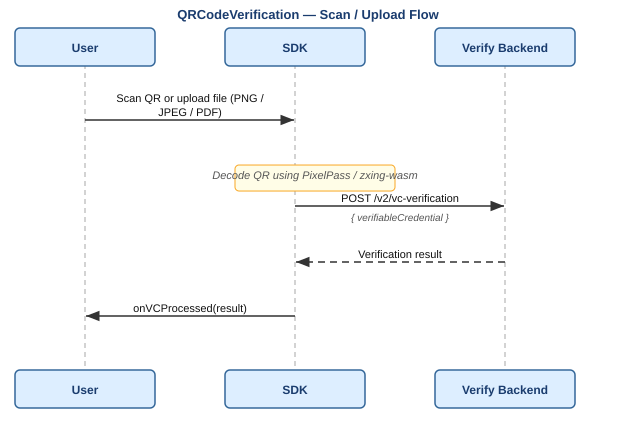
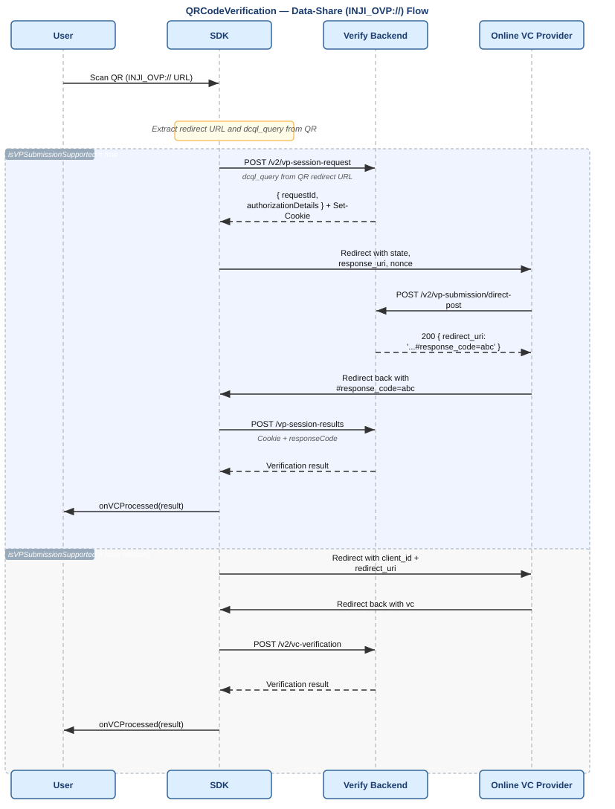
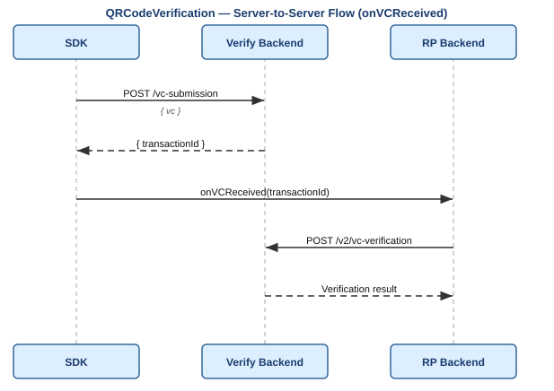

# Inji Verify SDK

The SDK is published as `@injistack/react-inji-verify-sdk` and provides two independent React components for embedding credential verification into a Relying Party UI.

| Component | Use case |
|---|---|
| `QRCodeVerification` | QR scan / file upload VC verification |
| `OpenID4VPVerification` | Online sharing via OpenID4VP v1.0 (QR code or wallet redirect) |

---

## Index

1. [Installation](#installation)
2. [QRCodeVerification](#qrcodeVerification)
   - [Props](#props)
   - [QR Code Types Handled](#qr-code-types-handled)
   - [Data-Share Flow](#data-share-online-vc-flow)
   - [Server-to-Server Flow](#server-to-server-flow)
   - [Result Shapes](#result-shapes)
   - [Basic Usage Example](#basic-usage-example)
3. [OpenID4VPVerification](#openid4vpverification)
   - [Props](#props-1)
   - [Flow Selection Logic](#flow-selection-logic)
   - [Result Shapes](#result-shapes-1)
   - [Basic Usage Example](#basic-usage-example-1)
4. [`require_cryptographic_holder_binding`](#require_cryptographic_holder_binding)

---

## Installation

```bash
npm install @injistack/react-inji-verify-sdk
```

---

## QRCodeVerification

Handles VC verification via camera scan or file upload. Decodes QR codes using the [PixelPass](https://github.com/inji/pixelpass) library, then calls the Verify Backend to verify the credential.

Also handles **data-share (online VC) QR codes** — QR codes that contain a redirect URL to an Online VC Provider rather than an embedded credential.

### Import

```tsx
import { QRCodeVerification } from "@injistack/react-inji-verify-sdk";
```

### Props

#### Required

| Prop | Type | Description |
|---|---|---|
| `verifyServiceUrl` | `string` | Base URL of the Verify Backend |
| `clientId` | `string` | Client identifier, used in data-share redirect flows |
| `onError` | `(error: Error) => void` | Called on any error |

#### Result callbacks (exactly one required)

| Prop | Type | Description |
|---|---|---|
| `onVCProcessed` | `(results: VerificationResults) => void` | Client-side verification. SDK calls `/v2/vc-verification` and returns result |
| `onVCReceived` | `(txnId: string) => void` | Server-to-server flow. SDK submits VC to `/vc-submission` and returns the `transactionId` |

#### Optional

| Prop | Type | Default | Description |
|---|---|---|---|
| `isEnableScan` | `boolean` | `true` | Enable camera scanning |
| `isEnableUpload` | `boolean` | `true` | Enable file upload |
| `isEnableZoom` | `boolean` | `true` | Enable camera zoom slider (mobile only) |
| `isVPSubmissionSupported` | `boolean` | `false` | Enable VP-based data-share flow for online VC sharing QR codes |
| `triggerElement` | `ReactNode` | — | Element that opens the scanner/uploader |
| `transactionId` | `string` | — | Optional transaction ID to reuse |
| `scannerActive` | `boolean` | `true` | Enable/disable the scanner |
| `onClose` | `() => void` | — | Called when the scanner is closed |
| `uploadButtonId` | `string` | — | Custom ID for the upload button |
| `uploadButtonStyle` | `string` | — | Custom CSS class for the upload button |
| `vcVerificationV2Request` | `VCVerificationV2Request` | — | Controls verification checks |
| `summariseResults` | `boolean` | `true` | When `true`, returns simplified `verificationStatus`. When `false`, returns full per-check breakdown |

**`VCVerificationV2Request` options:**

| Key | Type | Default | Description |
|---|---|---|---|
| `skipStatusChecks` | `boolean` | `false` | Skip revocation/suspension checks |
| `statusCheckFilters` | `string[]` | `[]` | Run only selected checks |
| `includeClaims` | `boolean` | `false` | Include extracted claims in result |

**Supported upload formats:** PNG, JPEG, JPG, PDF  
**File size limits:** 10 KB minimum, 5 MB maximum

### QR Code Types Handled

| QR content | Behaviour |
|---|---|
| Embedded VC (JSON-LD, SD-JWT, CWT) | Decoded with [PixelPass](https://github.com/inji/pixelpass), verified via `/v2/vc-verification` |
| Data-share URL (starts with `INJI_OVP://`) | See data-share flow below |

### Sequence — Standard Scan/Upload Flow



### Data-Share (Online VC) Flow

When the QR code contains a data-share URL (prefixed with `INJI_OVP://`):

**`isVPSubmissionSupported=false` (default):** Redirects directly to the Online VC Provider with `client_id` and `redirect_uri`. The provider returns a VC via redirect. Simple redirect, no backend VP session involved.

**`isVPSubmissionSupported=true`:** Full VP flow — creates a VP request on the backend, redirects to the Online VC Provider with full authorization parameters, receives `response_code` on redirect back, and fetches results via `/vp-session-results`.



### Server-to-Server Flow

Use `onVCReceived` when the Relying Party backend handles verification:



### Result Shapes

**`summariseResults=true` (default):**
```json
[
  {
    "vc": { "...": "..." },
    "verificationResponse": {
      "verificationStatus": "SUCCESS"
    }
  }
]
```

**`summariseResults=false`:**
```json
[
  {
    "vc": { "...": "..." },
    "verificationResponse": {
      "allChecksSuccessful": true,
      "schemaAndSignatureCheck": { "valid": true, "error": null },
      "expiryCheck": { "valid": true },
      "statusCheck": [{ "purpose": "revocation", "valid": true, "error": null }],
      "claims": { "givenName": "Alice" }
    }
  }
]
```

#### Response Fields Summary

| Property | Type | Description |
|---|---|---|
| `vc` | object | The VC that has been verified |
| `allChecksSuccessful` | boolean | Final aggregated validation flag |
| `schemaAndSignatureCheck` | object | Schema and signature validation result |
| `schemaAndSignatureCheck.valid` | boolean | If false, credential signature or schema is invalid |
| `schemaAndSignatureCheck.error` | object | Non-null if the check could not be performed |
| `expiryCheck` | object | Expiry validation result |
| `expiryCheck.valid` | boolean | If false, the credential is EXPIRED |
| `statusCheck` | array | Contains revocation and other status validations |
| `statusCheck[].purpose` | string | Identifies purpose (e.g., "revocation") |
| `statusCheck[].valid` | boolean | If false for revocation and `error` is null → credential is revoked |
| `statusCheck[].error` | object | Non-null if the status check could not be performed (e.g. status list unreachable) |
| `claims` | object | Includes all claims from credentialSubject |

### Basic Usage Example

```tsx
import { QRCodeVerification } from "@injistack/react-inji-verify-sdk";

<QRCodeVerification
  verifyServiceUrl="https://verify.example.com/v1/verify"
  clientId="client123"
  isEnableScan={true}
  isEnableUpload={true}
  triggerElement={<button>Scan / Upload</button>}
  onVCProcessed={(results) => console.log(results)}
  onError={(err) => console.error(err)}
  vcVerificationV2Request={{ skipStatusChecks: false, statusCheckFilters: ["revocation"], includeClaims: true }}
/>
```

---

## OpenID4VPVerification

Handles the full OpenID4VP v1.0 flow — creates the VP request, displays a QR code or redirects to a wallet, polls for status, and returns verification results. Supports cross-device and same-device (mobile and web wallet) flows.

For a detailed description of each flow see [OpenID4VP-1.0.0.md](./OpenID4VP-1.0.0.md).

### Import

```tsx
import { OpenID4VPVerification } from "@injistack/react-inji-verify-sdk";
```

### Props

#### Required

| Prop | Type | Description |
|---|---|---|
| `verifyServiceUrl` | `string` | Base URL of the Verify Backend (e.g. `https://verify.example.com/v1/verify`) |
| `clientId` | `string` | Verifier client identifier. Use the pre-registered string for by-value flows or `decentralized_identifier:did:...` for DID-based by-reference flows |
| `dcqlQuery` | `DcqlQuery` | DCQL query describing which credentials to request. Replaces `presentationDefinition`. Note: `trusted_authorities` is not supported — queries containing it will be rejected. |
| `onQrCodeExpired` | `() => void` | Called when the QR code / authorization request expires before submission |
| `onError` | `(error: AppError) => void` | Called on any error during the flow |

#### Result callbacks (exactly one required)

| Prop | Type | Description |
|---|---|---|
| `onVPProcessed` | `(results: VerificationResults) => void` | Client-side result retrieval. SDK fetches and returns verification results. Use this for most integrations |
| `onVPReceived` | `(transactionId: string) => void` | Server-to-server flow. SDK only signals VP receipt; the Relying Party backend fetches results using `transactionId` |

#### Optional

| Prop | Type | Default | Description |
|---|---|---|---|
| `isSameDeviceFlowEnabled` | `boolean` | `true` | When `true`, triggers same-device flow on click. When `false`, always shows QR code (cross-device) |
| `webWalletBaseUrl` | `string` | — | Base URL of a web wallet. When set, redirects to `{webWalletBaseUrl}/authorize?...` instead of a native wallet deep link. Same-device flows (this and mobile) set `responseCodeValidationRequired` so submission returns `redirect_uri`. |
| `triggerElement` | `ReactNode` | — | UI element that starts the flow on click. If omitted, the flow starts automatically on mount |
| `transactionId` | `string` | — | Optional. Reuse an existing transaction instead of generating one |
| `protocol` | `string` | `openid4vp://` | URI scheme prefix for QR code / deep link construction |
| `qrCodeStyles` | `object` | See below | QR code appearance options |
| `vpVerificationRequest` | `VPVerificationRequest` | — | Controls which verification checks to run when fetching results |
| `summariseResults` | `boolean` | `true` | When `true`, returns simplified `vcStatus` per credential. When `false`, returns full per-check breakdown |

**`qrCodeStyles` options:**

| Key | Default | Description |
|---|---|---|
| `size` | `200` | QR code size in pixels |
| `level` | `"L"` | Error correction level (`L`, `M`, `Q`, `H`) |
| `bgColor` | `"#ffffff"` | Background colour |
| `fgColor` | `"#000000"` | Foreground colour |
| `margin` | `10` | Margin in pixels |
| `borderRadius` | `10` | Border radius in pixels |

**`VPVerificationRequest` options:**

| Key | Type | Default | Description |
|---|---|---|---|
| `skipStatusChecks` | `boolean` | `false` | Skip revocation/suspension checks |
| `statusCheckFilters` | `string[]` | `[]` | Run only selected checks (e.g. `["revocation"]`) |
| `includeClaims` | `boolean` | `false` | Include extracted claims in result |

### Flow Selection Logic

The component determines which flow to use at trigger time:

```
isSameDeviceFlowEnabled = false
  → Cross-device: generate QR code

isSameDeviceFlowEnabled = true (default)
  → webWalletBaseUrl provided
      → Same-device web wallet: redirect to {webWalletBaseUrl}/authorize?...
  → Mobile device (detected via user agent)
      → Same-device mobile wallet: redirect to openid4vp://authorize?...
  → Desktop without webWalletBaseUrl
      → Error: MISSING_WEB_WALLET_BASE_URL
```

**`redirect_uri` after VP submission**

Same-device flows set the existing `responseCodeValidationRequired` flag. The backend then generates a `response_code` and returns `redirect_uri` after VP submission (existing behaviour). Cross-device QR omits the flag and receives an empty `200 {}`.

| Flow | `responseCodeValidationRequired` | After VP submission |
|---|---|---|
| Cross-device (QR) | omitted / `false` | `200 {}` — no `redirect_uri` |
| Same-device mobile | `true` | `{ "redirect_uri": "https://.../#response_code=..." }`. Original tab can still resume via `visibilitychange` + session cookie |
| Same-device web wallet | `true` | `{ "redirect_uri": "https://.../#response_code=..." }` |

For flow diagrams covering cross-device, same-device mobile, same-device web wallet, and server-to-server flows, see [OpenID4VP-1.0.0.md](./OpenID4VP-1.0.0.md).

### Server-to-Server Flow

When the Relying Party has its own backend and wants to process results there, use `onVPReceived` instead of `onVPProcessed`.

### Result Shapes

**`summariseResults=true` (default):**

The outer array has one element per credential requested. Each element's `verificationResponse` contains the full `vcResults` list (all credentials) and the overall `vpResultStatus`. For a two-credential VP request:

```json
[
  {
    "vc": { "...": "credential-1 data..." },
    "verificationResponse": {
      "vcResults": [
        { "vc": { "...": "credential-1 data..." }, "vcStatus": "SUCCESS" },
        { "vc": { "...": "credential-2 data..." }, "vcStatus": "SUCCESS" }
      ],
      "vpResultStatus": "SUCCESS"
    }
  },
  {
    "vc": { "...": "credential-2 data..." },
    "verificationResponse": {
      "vcResults": [
        { "vc": { "...": "credential-1 data..." }, "vcStatus": "SUCCESS" },
        { "vc": { "...": "credential-2 data..." }, "vcStatus": "SUCCESS" }
      ],
      "vpResultStatus": "SUCCESS"
    }
  }
]
```

`vpResultStatus` values: `"SUCCESS"` or `"INVALID"`. `vcStatus` values: `"SUCCESS"`, `"INVALID"`, `"EXPIRED"`, `"REVOKED"`.

**`summariseResults=false`:**
```json
[
  {
    "vc": { "...": "..." },
    "verificationResponse": {
      "verifiableCredential": "...",
      "allChecksSuccessful": true,
      "holderProofCheck": { "valid": true, "error": null },
      "schemaAndSignatureCheck": { "valid": true, "error": null },
      "expiryCheck": { "valid": true },
      "statusCheck": [{ "purpose": "revocation", "valid": true, "error": null }],
      "claims": { "givenName": "Alice" }
    }
  }
]
```

#### Response Fields Summary

| Property | Type | Description |
|---|---|---|
| `allChecksSuccessful` | boolean | Final aggregated validation flag |
| `verifiableCredential` | string | The VC that has been verified |
| `holderProofCheck` | object | Holder binding result. `null` when `require_cryptographic_holder_binding=false` |
| `holderProofCheck.valid` | boolean | If false, presenter does not own the credential |
| `holderProofCheck.error` | object | Non-null if the check could not be performed |
| `schemaAndSignatureCheck` | object | Schema and signature validation result |
| `schemaAndSignatureCheck.valid` | boolean | If false, credential signature or schema is invalid |
| `schemaAndSignatureCheck.error` | object | Non-null if the check could not be performed |
| `expiryCheck` | object | Expiry validation result |
| `expiryCheck.valid` | boolean | If false, the credential is EXPIRED |
| `statusCheck` | array | Contains revocation and other status validations |
| `statusCheck[].purpose` | string | Identifies purpose (e.g., "revocation") |
| `statusCheck[].valid` | boolean | If false for revocation and `error` is null → credential is revoked |
| `statusCheck[].error` | object | Non-null if the status check could not be performed (e.g. status list unreachable) |
| `claims` | object | Includes all claims from credentialSubject |

### Error Object

```ts
type AppError = {
  errorMessage: string;
  errorCode?: string;
  transactionId?: string | null;
}
```

### Basic Usage Example

```tsx
import { OpenID4VPVerification } from "@injistack/react-inji-verify-sdk";

<OpenID4VPVerification
  verifyServiceUrl="https://verify.example.com/v1/verify"
  clientId="client123"
  dcqlQuery={{
    credentials: [
      {
        id: "age_credential",
        format: "ldp_vc",
        meta: { type_values: [["VerifiableCredential", "AgeCredential"]] }
      }
    ]
  }}
  isSameDeviceFlowEnabled={false}
  triggerElement={<button>Verify</button>}
  onVPProcessed={(results) => console.log(results)}
  onQrCodeExpired={() => console.log("Expired")}
  onError={(err) => console.error(err)}
  vpVerificationRequest={{ skipStatusChecks: false, statusCheckFilters: ["revocation"], includeClaims: true }}
/>
```

---

## `require_cryptographic_holder_binding`

Each credential entry in `dcqlQuery` accepts a `require_cryptographic_holder_binding` flag (default `true`) that controls whether the wallet must prove cryptographic ownership of the credential.

| Value | Behavior | `holderProofCheck` in result |
|---|---|---|
| `true` (default) | Wallet must wrap the VC in a signed VP. The verifier checks that the presenter owns the credential. | Populated — `valid: true` if holder proof passes |
| `false` | Wallet may submit the VC without a VP wrapper (bare VC). No holder binding check is performed. | `null` |

**Format-specific behavior:**

- **`ldp_vc`**: when `true`, the wallet submits a JSON-LD VP with a `proof` field. When `false`, a bare VC is accepted.
- **`dc+sd-jwt` / `vc+sd-jwt`**: when `true`, a Key Binding JWT (KB-JWT) is required. The KB-JWT payload must contain all four fields: `aud`, `nonce`, `iat`, `sd_hash`. When `false`, KB-JWT validation is skipped.

**Example — disable holder binding for a specific credential:**

```tsx
dcqlQuery={{
  credentials: [{
    id: "age_credential",
    format: "ldp_vc",
    meta: { type_values: [["VerifiableCredential", "AgeCredential"]] },
    require_cryptographic_holder_binding: false  // accept bare VC, holderProofCheck will be null
  }]
}}
