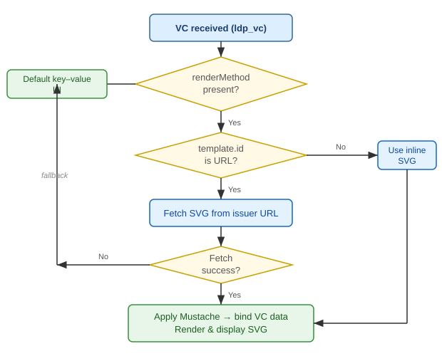

# VC Format: W3C JSON-LD (ldp_vc)

Inji Verify supports W3C Verifiable Credentials in JSON-LD format (`ldp_vc`) following the W3C VC Data Model.

| Specification | Version |
|---|---|
| W3C VC Data Model | [1.1](https://www.w3.org/TR/vc-data-model-1.1/) and [2.0](https://www.w3.org/TR/vc-data-model-2.0/) |
| W3C VC Render Method | [Draft](https://w3c-ccg.github.io/vc-render-method/) |
| W3C Language & Direction | [1.1](https://www.w3.org/TR/vc-data-model-1.1/#language-and-base-direction) and [2.0](https://www.w3.org/TR/vc-data-model-2.0/#language-and-base-direction) |

---

## Index

1. [Data Model Support](#data-model-support)
2. [Issuer Signature](#issuer-signature)
   - [Signature Suites](#signature-suites)
   - [Key Resolution](#key-resolution)
3. [VC Verification API](#vc-verification-api)
4. [Revocation](#revocation)
5. [DCQL Query for ldp_vc](#dcql-query-for-ldp_vc)
6. [SVG Template Rendering](#svg-template-rendering)
7. [Multilanguage Rendering](#multilanguage-rendering)

---

## Data Model Support

Inji Verify accepts both VC Data Model 1.1 and 2.0 credentials at all endpoints. The key differences that affect how you issue and verify credentials are:

| Field / Feature | Data Model 1.1 | Data Model 2.0 |
|---|---|---|
| `@context` (first entry) | `https://www.w3.org/2018/credentials/v1` | `https://www.w3.org/ns/credentials/v2` |
| Issuance date field | `issuanceDate` (required, datetime string) | `validFrom` (required, datetime string) |
| Expiry date field | `expirationDate` (optional) | `validUntil` (optional) |
| Credential status | `credentialStatus` with `BitstringStatusListEntry` | `credentialStatus` with `BitstringStatusListEntry` |
| `renderMethod` | Extension — not in spec, but accepted | Native top-level property in spec |
| Multilanguage values | `language`/`value` or `@language`/`@value` pair arrays | `language`/`value` or `@language`/`@value` pair arrays |
| Proof mechanism | `LinkedDataProof` (`proof` field) | `LinkedDataProof` or `DataIntegrityProof` (`proof` field) |

The examples below highlight only the fields that differ between the two versions.

**Data Model 1.1**

```json
{
  "@context": ["https://www.w3.org/2018/credentials/v1", "..."],
  "issuanceDate": "2024-01-01T00:00:00Z",
  "expirationDate": "2027-01-01T00:00:00Z",
  "proof": {
    "type": "Ed25519Signature2018",
    "jws": "eyJ..."
  }
}
```

**Data Model 2.0**

```json
{
  "@context": ["https://www.w3.org/ns/credentials/v2", "..."],
  "validFrom": "2024-01-01T00:00:00Z",
  "validUntil": "2027-01-01T00:00:00Z",
  "renderMethod": [{ "type": "TemplateRenderMethod", "renderSuite": "svg-mustache", "..." : "..." }],
  "proof": {
    "type": "Ed25519Signature2020",
    "proofValue": "z..."
  }
}
```

In summary: `@context` URL, date field names (`issuanceDate`/`expirationDate` → `validFrom`/`validUntil`), native `renderMethod` support, and the preferred proof suite (`Ed25519Signature2020` with `proofValue` instead of `jws`).

Both are accepted by the `POST /v2/vc-verification` endpoint, which takes a plain verifiable credential in the request body. The OpenID4VP `vp_token` submission is a separate flow — credentials are delivered by a wallet via `POST /v2/vp-submission/direct-post` and verified as part of the VP processing pipeline, not through `/v2/vc-verification`.

---

## Issuer Signature

`ldp_vc` credentials are signed using **Linked Data Proofs** embedded in the `proof` field of the JSON-LD document. Unlike JWT-based formats, the signature is not a detached header — it is part of the credential document itself and is verified by re-canonicalizing the JSON-LD and checking the proof.

### Signature Suites

Inji Verify (via the [vc-verifier](https://github.com/inji/vc-verifier) Kotlin library) supports the following proof types and their associated algorithms:

| Proof type (`proof.type`) | Algorithm | Proof field |
|---|---|---|
| `RsaSignature2018` | RS256 or PS256 (read from JWS header) | `jws` (detached JWS) |
| `Ed25519Signature2018` | EdDSA (Ed25519) | `jws` (detached JWS) |
| `Ed25519Signature2020` | EdDSA (Ed25519) | `proofValue` (multibase) |
| `EcdsaSecp256k1Signature2019` | ES256K | `jws` (detached JWS) |
| `EcdsaSecp256r1Signature2019` | ES256 | `jws` (detached JWS) |

`Ed25519Signature2020` is the recommended suite for new credentials — it uses a `proofValue` multibase encoding rather than JWS, which is simpler to implement and avoids the `b64` header complexity of 2018 suites.

### Credential Example (Ed25519Signature2020)

```json
{
  "@context": [
    "https://www.w3.org/ns/credentials/v2",
    "https://w3id.org/security/suites/ed25519-2020/v1"
  ],
  "type": ["VerifiableCredential", "AgeCredential"],
  "issuer": "did:web:issuer.example.org",
  "credentialSubject": { "age": 30 },
  "proof": {
    "type": "Ed25519Signature2020",
    "created": "2024-01-15T10:00:00Z",
    "verificationMethod": "did:web:issuer.example.org#key-1",
    "proofPurpose": "assertionMethod",
    "proofValue": "z..."
  }
}
```

### Key Resolution

The verifier resolves the issuer's public key from the `verificationMethod` URI in the proof. Supported resolution methods:

| DID / URL method | Example `verificationMethod` | Resolution mechanism |
|---|---|---|
| `did:web` | `did:web:issuer.example.org#key-1` | Constructs URL: no path → `https://issuer.example.org/.well-known/did.json`; with path segments (`did:web:example.org:a:b`) → `https://example.org/a/b/did.json`. Finds the `verificationMethod` entry whose `id` matches the full `verificationMethod` URI. Key can be `publicKeyJwk`, `publicKeyMultibase`, `publicKeyPem`, or `publicKeyHex`. |
| `did:key` | `did:key:z6Mk...#z6Mk...` | Decodes the multibase key from the DID string. Supported key types: **Ed25519** and **P-256** only. |
| `did:jwk` | `did:jwk:eyJ...#0` | Decodes the base64url JWK embedded in the DID string. Supports OKP (Ed25519), EC, and RSA key types. |
| HTTPS URL (JWKS) | `https://issuer.example.org/keys/jwks.json` | Fetch the JWKS endpoint; key matched by `kid`. URL must end in `jwks.json`. |
| HTTPS URL (direct) | `https://issuer.example.org/keys/1` | Fetch the URL; expects a JSON document with `publicKeyJwk`, `publicKeyMultibase`, `publicKeyPem`, or `publicKeyHex`. |

---

## VC Verification API

Two endpoints are available. Use **v2** for new integrations.

### POST /v2/vc-verification (recommended)

Accepts JSON. Format is auto-detected from the credential content — no Content-Type hint needed.

```http
POST /v2/vc-verification
Content-Type: application/json

{
  "verifiableCredential": { "@context": ["..."], "type": ["VerifiableCredential", "..."], "...": "..." },
  "skipStatusChecks": false,
  "statusCheckFilters": ["revocation"],
  "includeClaims": true
}
```

The backend passes the credential to the `vc-verifier` library (Kotlin), which performs:

| Check | Description |
|---|---|
| Schema & signature | JSON-LD proof verification against the issuer's public key |
| Expiry | `expirationDate` (DM 1.1) / `validUntil` (DM 2.0) compared to current time |
| Revocation | BitstringStatusList bit check at `statusListIndex` (skipped if `skipStatusChecks: true`) |

Response:

```json
{
  "allChecksSuccessful": true,
  "schemaAndSignatureCheck": { "valid": true, "error": null },
  "expiryCheck": { "valid": true },
  "statusCheck": [{ "purpose": "revocation", "valid": true, "error": null }],
  "claims": { "name": "Alice", "age": 30 }
}
```

`claims` is populated only when `includeClaims: true`.

### POST /vc-verification (legacy v1)

Accepts the raw JSON-LD string as the request body. Format is determined by the `Content-Type` header — any value other than `application/dc+sd-jwt`, `application/vc+sd-jwt`, or `application/vc+cwt` is treated as `ldp_vc`.

```http
POST /vc-verification
Content-Type: application/ld+json

{ "@context": ["https://www.w3.org/2018/credentials/v1", "..."], "type": ["VerifiableCredential", "..."], ... }
```

Response is a simplified status only — no per-check detail, no claims:

```json
{
  "verificationStatus": "SUCCESS"
}
```

`verificationStatus` values: `SUCCESS`, `INVALID`, `EXPIRED`, `REVOKED`.

---

## Revocation

> Applies to `ldp_vc` only. SD-JWT and CWT credentials do not support revocation status checks.

Inji Verify checks credential status via the **W3C Bitstring Status List** mechanism (`BitstringStatusListEntry`). The `credentialStatus` field in the VC points to the issuer's status list:

```json
"credentialStatus": {
  "id": "https://example.org/status/24#94567",
  "type": "BitstringStatusListEntry",
  "statusPurpose": "revocation",
  "statusListIndex": "94567",
  "statusListCredential": "https://example.org/status/24"
}
```

The backend fetches the `statusListCredential` (itself a signed `ldp_vc` with `credentialSubject.type = BitstringStatusList`), decodes the gzip-compressed, base64url-encoded bitstring (`encodedList`), and reads the bit(s) at `statusListIndex`. A non-zero value at that position means the credential is revoked (or suspended, depending on `statusPurpose`).

> **Note:** Only `BitstringStatusListEntry` is supported. Credentials using `StatusList2021Entry` will fail status checks.

Revocation checks can be controlled per-request:

```json
{
  "skipStatusChecks": false,
  "statusCheckFilters": ["revocation"]
}
```

---

## DCQL Query for ldp_vc

When requesting JSON-LD credentials via OpenID4VP, use `ldp_vc` as the format. The full set of supported fields per credential query entry:

| Field | Type | Description |
|---|---|---|
| `id` | string | Required. Alphanumeric, `_`, `-` only. Must be unique across credentials. |
| `format` | string | `ldp_vc` |
| `meta.type_values` | `string[][]` | OR-of-ANDs type constraint. At least one inner array must be fully present in the credential's `type` field. Cannot be combined with `vct_values`. |
| `claims` | array | List of claim entries to require from the credential. |
| `claims[].id` | string | Claim identifier — required when `claim_sets` is present. |
| `claims[].path` | array | Path into `credentialSubject` (not the VC root). String → object key, `null` → array wildcard, integer → array index. |
| `claims[].values` | array | Optional. Resolved value must match one of these (exact type+value). Supported types: string, integer, boolean, null. |
| `claim_sets` | `string[][]` | OR-of-ANDs over claim IDs. At least one inner array of claim IDs must be fully satisfied. Requires all claims to have `id`. |
| `credential_sets` | array | Groups credential queries with `required`/optional distinction. At least one `credential_set` must have `required: true`. |
| `multiple` | boolean | Default `false`. When `false`, wallet must submit exactly one credential for this query entry. |
| `require_cryptographic_holder_binding` | boolean | Default `true`. When `true`, wallet must wrap the VC in a signed VP. When `false`, wallet may submit a bare VC. |

### Example

```json
{
  "credentials": [
    {
      "id": "age_credential",
      "format": "ldp_vc",
      "meta": {
        "type_values": [["VerifiableCredential", "AgeCredential"]]
      },
      "claims": [
        { "path": ["age"] },
        { "path": ["name"] }
      ]
    }
  ]
}
```

> **Claim path root:** Paths are resolved against `credentialSubject`, not the VC root. `["age"]` matches `credentialSubject.age`. Do not include `"credentialSubject"` as the first path element.

### `type_values` — OR-of-ANDs

Each inner array is a required type set; at least one must be fully present in the credential's `type` array:

```json
"type_values": [
  ["VerifiableCredential", "AgeCredential"],
  ["VerifiableCredential", "IdCredential"]
]
```

This accepts credentials that are either an `AgeCredential` or an `IdCredential`. Each type value must be a valid IRI (plain strings like `"AgeCredential"` are accepted as relative IRIs).

### `claim_sets` — Optional subset requests

Use `claim_sets` when the wallet may satisfy the request with different subsets of claims:

```json
{
  "id": "age_credential",
  "format": "ldp_vc",
  "claims": [
    { "id": "age",      "path": ["age"] },
    { "id": "dob",      "path": ["dateOfBirth"] },
    { "id": "fullname", "path": ["name"] }
  ],
  "claim_sets": [
    ["age", "fullname"],
    ["dob", "fullname"]
  ]
}
```

At least one option must be fully satisfied. When `claim_sets` is present, all `claims` entries must have an `id`.

---

## SVG Template Rendering

Issuers can embed a `renderMethod` in their credential to provide a custom visual layout — identity cards, certificates, branded badges — instead of the default key–value display.

Inji Verify follows the W3C VC Render Method draft using the `svg-mustache` render suite: the issuer hosts an SVG template with `{{/credentialSubject/fieldName}}` Mustache placeholders; Inji Verify fetches it, binds the VC data, and renders the result.

### Credential Example

```json
{
  "@context": ["https://www.w3.org/ns/credentials/v2"],
  "type": ["VerifiableCredential", "MembershipCard"],
  "issuer": "https://issuer.example.org",
  "credentialSubject": {
    "id": "did:example:123",
    "name": "Alice",
    "memberSince": "2023-01-01"
  },
  "renderMethod": [
    {
      "type": "TemplateRenderMethod",
      "renderSuite": "svg-mustache",
      "template": {
        "id": "https://issuer.example.org/render/membership-card.svg",
        "mediaType": "image/svg+xml"
      }
    }
  ]
}
```

| `renderMethod` field | Description |
|---|---|
| `type` | Rendering method type — `TemplateRenderMethod` |
| `renderSuite` | Rendering engine — `svg-mustache` |
| `template.id` | URL of the issuer-hosted SVG template |
| `template.mediaType` | `image/svg+xml` |

### Rendering Flow



If the SVG template cannot be fetched or rendered for any reason (missing template, fetch failure, invalid SVG), Inji Verify automatically falls back to the default key–value layout. The `renderMethod` is not part of the cryptographic proof — changing the template does not invalidate the credential's signature.

---

## Multilanguage Rendering

> Applies to `ldp_vc` only. SD-JWT credentials do not use this structure.

When an `ldp_vc` credential contains localized field values, Inji Verify renders them in the viewer's selected UI language.

**Supported languages:** English (`en`), Portuguese (`pt`), Tamil (`ta`), Kannada (`kn`), Hindi (`hi`), French (`fr`), Arabic (`ar`), Spanish (`es`), Khmer (`km`).

Issuers embed localized values using either format — both are handled identically:

```json
"gender": [
  { "language": "en", "value": "Male" },
  { "language": "fr", "value": "Homme" }
]
```

```json
"title": [
  { "@language": "en", "@value": "HTML and CSS" },
  { "@language": "ar", "@value": "HTML و CSS" }
]
```

**Selection logic:** Match selected UI language → fallback to English (`en`).

**RTL rendering:** When Arabic or another RTL language is selected, the full UI layout switches to right-to-left mode — text alignment, key–value ordering, and SVG template direction hints all apply.

