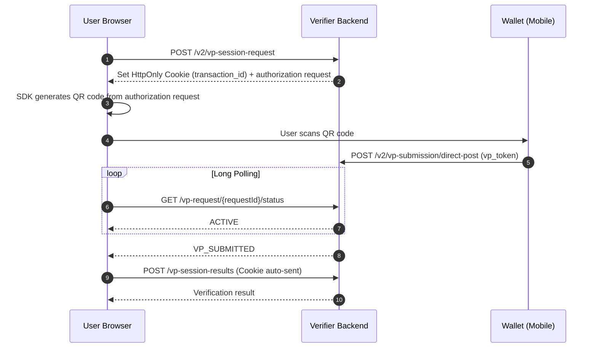
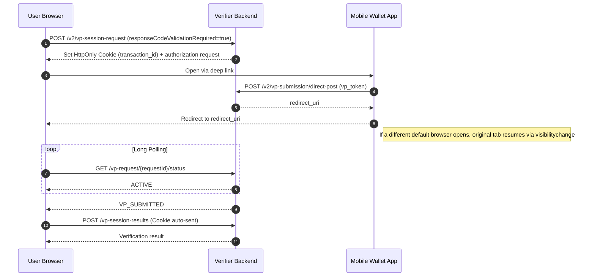
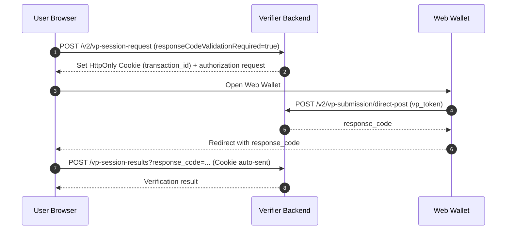

# INJI VERIFY SDK

**Repository:** [github.com/mosip/inji-verify](https://github.com/mosip/inji-verify)

Inji Verify SDK provides ready-to-use **React components** to integrate [OpenID4VP](https://openid.net/specs/openid-4-verifiable-presentations-1_0.html)-based **Verifiable Credential (VC) and Verifiable Presentation (VP) verification** into any React TypeScript web application.

## Index

1. [Pre-requisites](#pre-requisites)
2. [Usage Guide](#usage-guide)
   - [Install](#step-1-install-the-package)
   - [Choose Verification Method](#step-3-choose-verification-method)
   - [Verification Response](#verification-response)
3. [Detailed Component Guide](#detailed-component-guide)
   - [Option A: QR Code Verification](#option-a-qr-code-verification-scan--upload)
     - [Verification Response](#verification-response-1)
   - [Option B: OpenID4VP Verification](#option-b-openid4vp-verification)
     - [Verification Response](#verification-response-2)
     - [DCQL Query](#dcql-query)
     - [`require_cryptographic_holder_binding`](#require_cryptographic_holder_binding)
4. [Component Options Reference](#️-component-options-reference)
5. [Important Limitations](#️-important-limitations)

---

## Pre-requisites

### What You Need:

1. **A React project** (TypeScript recommended)
2. **A verification backend** - You need a server that can verify credentials
3. **Camera permissions** - For QR scanning features

### Backend Requirements:

Your backend must support the OpenID4VP protocol. You can either:

- Use the official `inji-verify-service`
- Build your own following [this specification](https://openid.net/specs/openid-4-verifiable-presentations-1_0.html)

**Important:** Your backend URL should look like:

```
https://your-backend.com/v1/verify
```

> **Note**
>
> - The SDK uses a session-based verification flow internally.
> - Session handling, redirects, and result fetching are managed by the SDK.
> - No manual handling of `transactionId` or browser storage is required.
## Usage Guide

### Step 1: Install the Package

```bash
npm i @injistack/react-inji-verify-sdk
```

### Step 2: Import & Usage

```javascript
import {
  OpenID4VPVerification,
  QRCodeVerification,
} from "@injistack/react-inji-verify-sdk";
```

### Step 3: Choose Verification Method

**Option A: QR Code Verification (Scan & Upload)**

```javascript
function MyApp() {
  return (
    <QRCodeVerification
        triggerElement={triggerElement} //UI element used to start verification.
        verifyServiceUrl="https://your-backend.com/v1/verify"
        isEnableScan={false}
        onVCProcessed={(result) => {
            console.log("Verification complete:", result);
            // Handle the verification result here
        }}
        onError={(error) => {
            console.log("Something went wrong:", error);
        }}
        clientId="did:example:123456789" // DID example
    />
  );
}
```

**Option B: OpenID4VP Verification**

```javascript
function MyApp() {
  return (
    <OpenID4VPVerification
        triggerElement={<button>Show QR for Wallet Scan</button>}
        verifyServiceUrl="https://your-backend.com/v1/verify"
        clientId="did:example:123456789" // DID example
        dcqlQuery={{
            credentials: [{ id: "id_card", format: "ldp_vc", meta: {} }]
        }}
        isSameDeviceFlowEnabled={false} // QR code flow
        onVPProcessed={(result) => {
            console.log("VP processed:", result);
        }}
        onQrCodeExpired={() => {
            console.log("QR code expired - ask user to retry");
        }}
        onError={(error) => {
            console.error("Verification error:", error);
        }}
    />
  );
}
```

## Verification Response

Once verification is complete, the response depends on the `summariseResults` attribute (default = true)

If `summariseResults = true`, the response will be:

#### For QRCodeVerification (Upload / Scan):


```javascript
{
    "verificationStatus":"STATUS"
}
```
#### For OpenID4VPVerification:
```javascript
{
  "vcResults": [
    {
      "vc": { /* Your verified credential data */ },
      "vcStatus": "SUCCESS" // or "INVALID", "EXPIRED", "REVOKED"
    }
  ],
  "vpResultStatus": "SUCCESS" // Overall verification status
}
```

> **Security Recommendation**
>
> Avoid consuming results directly from VPProcessed or VCProcessed.
> Instead, use VPReceived or VCReceived events to capture the transactionId, then retrieve the verification results securely from your backend's verification service endpoint.
> This ensures data integrity and prevents reliance on client-side verification data for final decisions.

## Detailed Component Guide
The following sections provide advanced usage and detailed configuration for each component.
> The package should already be installed as described in the Usage Guide.

### Option A: QR Code Verification (Scan & Upload)

The QRCodeVerification component enables end-to-end Verifiable Credential (VC) verification using QR codes in Inji-Verify. It supports both camera-based scanning and file upload for QR code verification.

**Perfect for:** Scanning QR codes from documents, or uploading QR codes (PNG, JPEG, JPG, PDF) within the supported size range of 10 KB to 5 MB.

Follow these steps to integrate:

#### Import & Usage

```javascript
import {QRCodeVerification} from "@injistack/react-inji-verify-sdk";
```

#### 1. Uploading a Verifiable Credential (VC) for verification

a. Client-side handling (onVCProcessed)

```javascript
function MyApp() {
  return (
  <QRCodeVerification 
      triggerElement={triggerElement} //UI element used to start verification.
      verifyServiceUrl="https://your-backend.com/v1/verify"
      isEnableScan={false}
      onVCProcessed={(result) => {
        console.log("Verification complete:", result);
        // Handle the verification result here
      }}
      onError={(error) => {
        console.log("Something went wrong:", error);
      }}
      clientId="did:example:123456789" // DID example
    />
  );
}
```
b. Server-to-server handling (onVCReceived)
```javascript
function MyApp() {
  return (
  <QRCodeVerification 
      triggerElement={triggerElement}
      verifyServiceUrl="https://your-backend.com/v1/verify"
      isEnableScan={false}
      onVCReceived={(transactionId) => {
          //using the transactionId, one can securely fetch the result from service
          console.log("VC received transactionId:", transactionId);
      }}
      onError={(error) => {
        console.log("Something went wrong:", error);
      }}
      clientId="client-12345" // non-DID example
    />
  );
}
```

> 🔁 **Verification Handling Modes**
>
> **Client-side Handling (`onVCProcessed` / `onVPProcessed`)**
> - SDK returns verification result directly to frontend
> - Faster and simple
>
> **Server-to-server Handling (`onVCReceived` / `onVPReceived`)**
> - SDK returns only `transactionId`
> - Backend fetches result securely

####  2. Scanning a Verifiable Credential (VC) Using Device Camera

a. Client-side handling (onVCProcessed)

```javascript
function MyApp() {
  return (
  <QRCodeVerification
      scannerActive={scannerActive}
      verifyServiceUrl="https://your-backend.com/v1/verify"
      isEnableUpload={false}
      onClose={onClose} // invoked when scanner is closed 
      onVCProcessed={(result) => {
        console.log("Verification complete:", result);
        // Handle the verification result here
      }}
      onError={(error) => {
        console.log("Something went wrong:", error);
      }}
      clientId="did:example:123456789" // DID example
    />
  );
}
```
b. Server-to-server handling (onVCReceived)

```javascript
function MyApp() {
  return (
  <QRCodeVerification
      scannerActive={scannerActive}
      verifyServiceUrl="https://your-backend.com/v1/verify"
      isEnableUpload={false}
      onClose={onClose} // invoked when scanner is closed 
      onVCReceived={(transactionId) => {
          //using the transactionId, one can securely fetch the result from service
          console.log("VC received transactionId:", transactionId);
      }}
      onError={(error) => {
        console.log("Something went wrong:", error);
      }}
      clientId="did:example:123456789" // DID example
    />
  );
}
```

### Verification Response

Once VC Verification is complete, the response depends on the `summariseResults` attribute (default = true)

If `summariseResults = true`, the response will be:

```javascript
{
    "verificationStatus":"STATUS"
}
```

If `summariseResults = false`, the response will be:

```javascript
{
    "allChecksSuccessful": true, 
    "schemaAndSignatureCheck": { "valid": true, "error": null },
    "expiryCheck": { "valid": true },
    "statusCheck": [
        { "purpose": "revocation", "valid": true, "error": null }
    ], 
    "claims": {...}
}
```

#### Response Fields Summary

| Property                  | Type    | Description                                               |
|---------------------------|---------|-----------------------------------------------------------|
| `vc`                           | object  | The VC that has been verified                                       |
| `allChecksSuccessful`          | boolean | Final aggregated validation flag                                    |
| `schemaAndSignatureCheck`      | object  | Schema and signature validation result                              |
| `schemaAndSignatureCheck.valid`| boolean | If false, credential signature or schema is invalid                 |
| `schemaAndSignatureCheck.error`| object  | Non-null if the check could not be performed                        |
| `expiryCheck`                  | object  | Expiry validation result                                            |
| `expiryCheck.valid`            | boolean | If false, the credential is EXPIRED                                 |
| `statusCheck`                  | array   | Contains revocation and other status validations                    |
| `statusCheck[].purpose`        | string  | Identifies purpose (e.g., "revocation")                             |
| `statusCheck[].valid`          | boolean | If false for revocation and `error` is null → credential is revoked |
| `statusCheck[].error`          | object  | Non-null if the status check could not be performed (e.g. status list unreachable) |
| `claims`                       | object  | Includes all claims from credentialSubject                          |

### Option B: OpenID4VP Verification
OpenID4VPVerification Component verifies Verifiable Presentations securely using OpenID4VP standards for both cross-device and same-device flows.

**Perfect for:** Integrating with digital wallets (like mobile ID apps)

Follow these steps to integrate:

#### Import & Usage

```javascript
import {OpenID4VPVerification} from "@injistack/react-inji-verify-sdk";
```

#### 1. Cross-device flow (QR code scan from another device)
```javascript
import { OpenID4VPVerification } from "@injistack/react-inji-verify-sdk";
export default function VerifyCrossDevice() {
    return (
        <OpenID4VPVerification
            triggerElement={<button>Show QR for Wallet Scan</button>}
            verifyServiceUrl="https://your-backend.com/v1/verify"
            clientId="did:example:123456789" // DID example
            dcqlQuery={{
                credentials: [{
                    id: "id_card",
                    format: "ldp_vc",
                    meta: { type_values: [["DriverLicenseCredential"]] },
                    claims: [{ path: ["name"] }]
                }]
            }}
            isSameDeviceFlowEnabled={false} // QR code flow
            onVPProcessed={(result) => {
                console.log("VP processed:", result);
            }}
            onQrCodeExpired={() => {
                console.log("QR code expired - ask user to retry");
            }}
            onError={(error) => {
                console.error("Verification error:", error);
            }}
        />
    );
}
```


#### 2. Same Device Flow with Mobile Wallet
Used when a native mobile wallet app is triggered via deep link.

```javascript
import { OpenID4VPVerification } from "@injistack/react-inji-verify-sdk";
export default function VerifySameDevice() {
    return (
        <OpenID4VPVerification
            triggerElement={<button>Verify with Wallet</button>}
            verifyServiceUrl="https://your-backend.com/v1/verify"
            clientId="client-12345" // non-DID example
            dcqlQuery={{
                credentials: [{
                    id: "id_card",
                    format: "ldp_vc",
                    meta: { type_values: [["DriverLicenseCredential"]] }
                }]
            }}
            isSameDeviceFlowEnabled={true} //default value
            // No webWalletBaseUrl → triggers mobile wallet via deep link
            onVPProcessed={(result) => {
                console.log("VP processed:", result);
            }}
            onError={(error) => {
                console.error("Verification error:", error);
            }}
        />
    );
}
```



> **NOTE**
>
> After VP submission the backend returns `redirect_uri` because the SDK sets `responseCodeValidationRequired=true` for same-device flows (existing implementation). Cross-device QR omits the flag and does not receive `redirect_uri`.
>
> If the wallet opens a different default browser than the one that started the flow, the original tab still resumes via a `visibilitychange` listener and the session cookie (without requiring `response_code`).

#### 3. Same Device Flow with Web Wallet 
Used when verification happens in a web-based wallet on the same device.

```javascript
import { OpenID4VPVerification } from "@injistack/react-inji-verify-sdk";
export default function VerifySameDevice() {
    return (
        <OpenID4VPVerification
            triggerElement={<button>Verify with Wallet</button>}
            verifyServiceUrl="https://your-backend.com/v1/verify"
            clientId="did:example:123456789" // DID example
            dcqlQuery={{
                credentials: [{
                    id: "id_card",
                    format: "ldp_vc",
                    meta: { type_values: [["DriverLicenseCredential"]] }
                }]
            }}
            isSameDeviceFlowEnabled={true} //default value
            webWalletBaseUrl="https://wallet.example.com" // required to support web-wallets 
            onVPProcessed={(result) => {
                console.log("VP processed:", result);
            }}
            onError={(error) => {
                console.error("Verification error:", error);
            }}
        />
    );
}
```



> **NOTE**
>
> When `webWalletBaseUrl` is configured, the SDK uses a web wallet. Without it, the SDK falls back to a deep link to launch a native mobile wallet if one is installed.
>
> After VP submission the backend returns `redirect_uri` when the SDK set `responseCodeValidationRequired=true` (same-device mobile and web wallet). Cross-device QR omits the flag and does not receive `redirect_uri`. The URI includes `#response_code=` so a web wallet can resume after a full-page redirect; same-device mobile can also resume from the original tab via the session cookie.


#### 4. Server-to-server callback (onVPReceived)
```javascript
import { OpenID4VPVerification } from "@injistack/react-inji-verify-sdk";

export default function VerifyServerToServer() {
    return (
        <OpenID4VPVerification
            triggerElement={<button>Start Verification</button>}
            verifyServiceUrl="https://your-backend.com/v1/verify"
            clientId="did:example:123456789" // DID example
            dcqlQuery={{
                credentials: [{
                    id: "id_card",
                    format: "ldp_vc",
                    meta: { type_values: [["DriverLicenseCredential"]] }
                }]
            }}
            isSameDeviceFlowEnabled={false}
            onVPReceived={(transactionId) => {
                //using the transactionId one can securely fetch the result from service
                console.log("VP received transactionId:", transactionId);
            }}
            onQrCodeExpired={() => {
                console.log("QR code expired");
            }}
            onError={(error) => {
                console.error("Verification error:", error);
            }}
        />
    );
}
```

### Verification Response

Once VP Verification is complete, the response depends on the `summariseResults` attribute (default = true)

If `summariseResults = true`, the response will be an array with one element per credential. Each element's `verificationResponse` contains the full `vcResults` list and the overall `vpResultStatus`:

```javascript
[
  {
    "vc": { /* credential-1 data */ },
    "verificationResponse": {
      "vcResults": [
        { "vc": { /* credential-1 data */ }, "vcStatus": "SUCCESS" }, // or "INVALID", "EXPIRED", "REVOKED"
        { "vc": { /* credential-2 data */ }, "vcStatus": "SUCCESS" }
      ],
      "vpResultStatus": "SUCCESS" // or "INVALID" — overall verification status
    }
  },
  {
    "vc": { /* credential-2 data */ },
    "verificationResponse": {
      "vcResults": [
        { "vc": { /* credential-1 data */ }, "vcStatus": "SUCCESS" },
        { "vc": { /* credential-2 data */ }, "vcStatus": "SUCCESS" }
      ],
      "vpResultStatus": "SUCCESS"
    }
  }
]
```

If `summariseResults = false`, the response will be:

```javascript
{
    "transactionId": "txn_11",
    "allChecksSuccessful": true,
    "credentialResults": [
        {
            "verifiableCredential": "{...}",
            "allChecksSuccessful": true,
            "holderProofCheck": { "valid": true, "error": null },
            "schemaAndSignatureCheck": { "valid": true, "error": null },
            "expiryCheck": { "valid": true },
            "statusCheck": [
                { "purpose": "revocation", "valid": true, "error": null }
            ],
            "claims": {...}
        }
    ]
}
```

#### Response Fields Summary

| Property                  | Type    | Description                                               |
|---------------------------|---------|-----------------------------------------------------------|
| `allChecksSuccessful`          | boolean | Final aggregated validation flag                                    |
| `verifiableCredential`         | string  | The VC that has been verified                                       |
| `holderProofCheck`             | object  | Holder binding result. `null` when `require_cryptographic_holder_binding=false` |
| `holderProofCheck.valid`       | boolean | If false, presenter does not own the credential                     |
| `holderProofCheck.error`       | object  | Non-null if the check could not be performed                        |
| `schemaAndSignatureCheck`      | object  | Schema and signature validation result                              |
| `schemaAndSignatureCheck.valid`| boolean | If false, credential signature or schema is invalid                 |
| `schemaAndSignatureCheck.error`| object  | Non-null if the check could not be performed                        |
| `expiryCheck`                  | object  | Expiry validation result                                            |
| `expiryCheck.valid`            | boolean | If false, the credential is EXPIRED                                 |
| `statusCheck`                  | array   | Contains revocation and other status validations                    |
| `statusCheck[].purpose`        | string  | Identifies purpose (e.g., "revocation")                             |
| `statusCheck[].valid`          | boolean | If false for revocation and `error` is null → credential is revoked |
| `statusCheck[].error`          | object  | Non-null if the status check could not be performed (e.g. status list unreachable) |
| `claims`                       | object  | Includes all claims from credentialSubject                          |

### DCQL Query:

The `dcqlQuery` prop describes which credentials to request from the wallet, following the [DCQL (Digital Credentials Query Language)](https://openid.net/specs/openid-4-verifiable-presentations-1_0.html) format.

> **Unsupported:** `trusted_authorities` is not currently supported. DCQL queries containing `trusted_authorities` will be rejected with `UNKNOWN_FIELD`.

**Minimal example — request a single ldp_vc:**

```javascript
dcqlQuery={{
  credentials: [{
    id: "id_card",
    format: "ldp_vc",
    meta: { type_values: [["DriverLicenseCredential"]] }
  }]
}}
```

**Request specific claims:**

```javascript
dcqlQuery={{
  credentials: [{
    id: "id_card",
    format: "dc+sd-jwt",
    meta: { vct_values: ["DriverLicenseCredential"] },
    claims: [
      { path: ["given_name"] },
      { path: ["birth_date"] }
    ]
  }]
}}
```

**Request multiple credential types (OR logic via credential_sets):**

```javascript
dcqlQuery={{
  credentials: [
    { id: "mdl", format: "dc+sd-jwt", meta: { vct_values: ["DriverLicense"] } },
    { id: "pid", format: "ldp_vc",    meta: { type_values: [["PersonalID"]] } }
  ],
  credential_sets: [
    { options: [["mdl"], ["pid"]] }  // wallet can satisfy with either
  ]
}}
```

**`require_cryptographic_holder_binding` — holder binding control:**

Each credential entry in `dcqlQuery` supports a `require_cryptographic_holder_binding` flag (default `true`) that controls whether the wallet must prove it cryptographically owns the credential:

| Value | Behavior | `holderProofCheck` in result |
|---|---|---|
| `true` (default) | Wallet must wrap the VC in a signed VP. The verifier checks that the presenter owns the credential. | Populated — `valid: true` if holder proof passes |
| `false` | Wallet may submit the VC without a VP wrapper (bare VC). No holder binding check is performed. | `null` |

Format-specific behavior:
- **`ldp_vc`**: when `true`, wallet submits a JSON-LD VP with a `proof` field; when `false`, bare VC is accepted.
- **`dc+sd-jwt` / `vc+sd-jwt`**: when `true`, a KB-JWT (Key Binding JWT) is required, containing `aud`, `nonce`, `iat`, and `sd_hash`; when `false`, KB-JWT is skipped.

```javascript
dcqlQuery={{
  credentials: [{
    id: "id_card",
    format: "ldp_vc",
    meta: { type_values: [["DriverLicenseCredential"]] },
    require_cryptographic_holder_binding: false  // accept bare VC, skip holder check
  }]
}}
```

## 🎛️ Component Options Reference

### Common Props (Both Components)

| Property                     | Type          | Required | Description                                 |
|------------------------------|---------------| ----- |---------------------------------------------|
| `verifyServiceUrl`           | string        | ✅     | Backend verification URL                    |
| `onError`                    | function      | ✅     | Callback invoked when an error occurs       |
| `triggerElement`             | React element | ❌     | Custom button/element to start verification |
| `transactionId`              | string        | ❌     | Optional client-side tracking ID            |
| `clientId`                   | string        | ✅     | Client identifier  (DID or Non-DID)         |
| `summariseResults`           | boolean       | ❌     | Decides format of SDK Response              |

### QRCodeVerification Specific

| Property                  | Type     | Default | Description                                |
|---------------------------|----------|---------|--------------------------------------------|
| `onVCProcessed`           | function | -       | Get full results immediately               |
| `onVCReceived`            | function | -       | Get transaction ID only                    |
| `isEnableUpload`          | boolean  | true    | Allow file uploads                         |
| `isEnableScan`            | boolean  | true    | Allow camera scanning                      |
| `isEnableZoom`            | boolean  | true    | Allow camera zoom (for mobile and tablets) |
| `uploadButtonStyle`       | string   | -       | Custom upload button styling               |
| `isVPSubmissionSupported` | boolean  | false   | Toggle VP submission support               |
| `vcVerificationV2Request` | object   | -       | contains request body for VC Verification  |

### OpenID4VPVerification Specific

| Property                  | Type     | Default        | Description                               |
|---------------------------| -------- |----------------|-------------------------------------------|
| `dcqlQuery`               | object   | -              | DCQL query describing requested credentials (required) |
| `protocol`                | string   | "openid4vp://" | Protocol for QR codes (optional)          |
| `onVPProcessed`           | function | -              | Get full results immediately              |
| `onVPReceived`            | function | -              | Get transaction ID only                   |
| `onQrCodeExpired`         | function | -              | Handle QR code expiration                 |
| `isSameDeviceFlowEnabled` | boolean  | true           | Enable same-device flow (optional)        |
| `webWalletBaseUrl`        | string   | -              | Web wallet authorize URL. Same-device (mobile and web) sets `responseCodeValidationRequired` so VP submission returns `redirect_uri`. |
| `qrCodeStyles`            | object   | -              | Customize QR code appearance              |
| `vpVerificationRequest`   | object   | -              | contains request body for VP Verification |

## ⚠️ Important Limitations

- **React Only:** Won't work with Angular, Vue, or React Native
- **Backend Required:** You must have a verification service running
